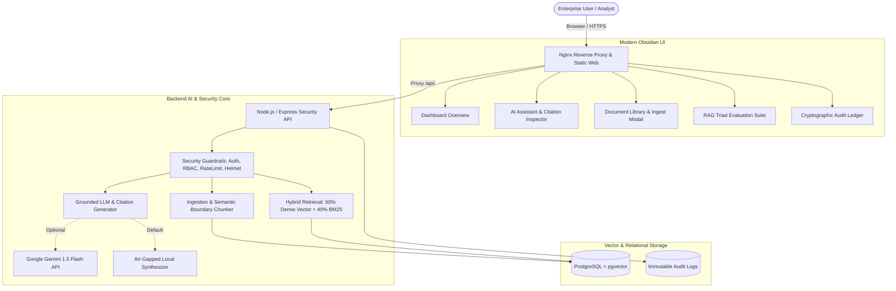

# 🛡️ PAIDI: Private AI Document Intelligence Platform

[](https://github.com/ktilak12/Private-AI-Document-Intelligence)
[](https://github.com/ktilak12/Private-AI-Document-Intelligence)
[](https://github.com/ktilak12/Private-AI-Document-Intelligence)
[](LICENSE)

**PAIDI** (Private AI Document Intelligence) is a production-grade, air-gapped document intelligence and retrieval-augmented generation (RAG) platform. Designed for sensitive legal, financial, and enterprise environments, PAIDI enables teams to upload confidential documents, index them into high-dimensional vector representations, ask natural-language questions, and receive grounded answers backed by exact source citations.

---

## 🏛️ System Architecture



---

## ✨ Key Features & Capabilities

### 1. 🔍 Grounded RAG with Verifiable Citations
* **Anti-Hallucination Pipeline**: Queries do not pass blindly to an LLM. Answers are synthesized strictly from retrieved evidence chunks.
* **Inline Verifiable Badges (`[1]`, `[2]`)**: Clicking any citation instantly opens the side-by-side evidence inspector displaying the source file, page number, relevance match score, and highlighted text snippet.

### 2. ⚡ Hybrid Neural & Lexical Retrieval
* Combines **60% Dense Vector Cosine Similarity** with **40% Lexical BM25 Keyword Scoring** for maximum context recall.
* Preserves paragraph, sentence, and character boundaries (`charStart`, `charEnd`) alongside estimated page numbers.

### 3. 🛡️ Enterprise Security & Threat Defense
* **Path Traversal & Safe Ingestion**: Filename scrubber (`sanitizeFilename()`) strips null bytes and directory traversal sequences (`../../`).
* **Extension & MIME Whitelist**: Only permits `.pdf`, `.docx`, `.txt`, `.md`, `.json`, and `.csv`.
* **Prompt Injection Guardrails**: Blocks malicious jailbreak patterns (e.g. *Ignore previous instructions*).
* **Traffic Governance**: Integrated `express-rate-limit` (200 req/15min global, 20 req/15min auth) and `helmet` security headers.
* **Authentication & RBAC**: JWT Bearer token authentication with 12-round salted `bcryptjs` password hashing.

### 4. 📊 Real-Time RAG Triad Telemetry
* Continuously calculates the three foundational metrics of retrieval quality:
  * **Faithfulness**: Is the answer factually supported by the retrieved context?
  * **Answer Relevance**: Does the response directly address the user's intent?
  * **Context Precision**: Did the retrieval engine select the most relevant chunks?
* Exportable cryptographic audit logs in JSON and CSV formats.

---

## 🚀 Quickstart Guide

### Option A: 1-Command Docker Deployment (Recommended)

To spin up the complete multi-container stack (Frontend Nginx, Backend API, PostgreSQL with `pgvector`):

```bash
docker compose up --build -d
```

* **Web UI**: Access at [http://localhost:80](http://localhost:80) or [http://localhost:8080](http://localhost:8080)
* **Backend API**: Access at [http://localhost:3000](http://localhost:3000)
* **PostgreSQL Database**: Port `5432`

---

### Option B: Local Development Setup

#### 1. Start Database Container
```bash
docker compose up -d db
```

#### 2. Install & Start Backend
```bash
cd backend
npm install
npx prisma db push
npm start
```

#### 3. Run Frontend Server
In a separate terminal in the root directory:
```bash
npm start
```
Open [http://localhost:3000](http://localhost:3000) or run with `npx serve .` to launch the frontend.

---

## 📡 REST API Reference

| Method | Endpoint | Protection | Description |
|---|---|---|---|
| `GET` | `/health` | Public | Health check and security headers status |
| `POST` | `/api/auth/register` | Rate-Limited | Register a new user (`admin`, `auditor`, `user`) |
| `POST` | `/api/auth/login` | Rate-Limited | Authenticate and obtain JWT Bearer token |
| `POST` | `/api/documents/upload` | `JWT Bearer` | Upload and chunk document (`multipart/form-data`) |
| `GET` | `/api/documents` | `JWT Bearer` | List all indexed documents with token counts |
| `DELETE` | `/api/documents/:id` | `JWT Bearer` | Remove document and associated chunks |
| `POST` | `/api/chat/query` | `JWT Bearer` | Execute hybrid RAG query with citations |
| `GET` | `/api/chat/history` | `JWT Bearer` | Retrieve query session history and telemetry |

---

## 🧪 Automated Test Suites

Run the end-to-end verification suites to validate all system layers:

```bash
# 1. Complete System Integration Test (5/5 Tests)
npm run test:integration

# 2. RAG Retrieval, Ingestion & Grounding Suite
npm run test:rag

# 3. Security Threat & Attack Defense Suite (4/4 Tests)
npm run test:security
```

---

## 📜 License
Developed under the MIT License. Enterprise and private deployment ready.
