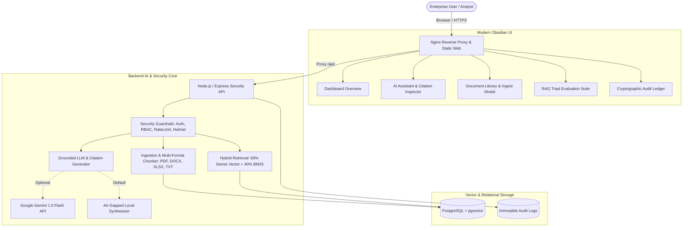

# 🛡️ PAIDI: Private AI Document Intelligence Platform

[](https://github.com/ktilak12/Private-AI-Document-Intelligence)
[](https://github.com/ktilak12/Private-AI-Document-Intelligence)
[](https://github.com/ktilak12/Private-AI-Document-Intelligence)
[](LICENSE)

**PAIDI** (Private AI Document Intelligence) is a production-grade, air-gapped document intelligence and retrieval-augmented generation (RAG) platform. Designed for sensitive legal, financial, and enterprise environments, PAIDI enables teams to upload confidential documents, index them into high-dimensional vector representations, ask natural-language questions, and receive grounded answers backed by exact source citations.

---

## 🏛️ System Architecture



---

## ✨ Key Features & Capabilities

### 1. 🔍 Grounded RAG with Verifiable Citations
* **Anti-Hallucination Pipeline**: Queries do not pass blindly to an LLM. Answers are synthesized strictly from retrieved evidence chunks.
* **Inline Verifiable Badges (`[1]`, `[2]`)**: Clicking any citation instantly opens the side-by-side evidence inspector displaying the source file, page number, relevance match score, and highlighted text snippet.
* **Server-Sent Events (SSE) Token Streaming**: Real-time typewriter token streaming (`POST /api/chat/stream`) with zero latency.

### 2. ⚡ Hybrid Neural & Lexical Retrieval
* Combines **60% Dense Vector Cosine Similarity** with **40% Lexical BM25 Keyword Scoring** for maximum context recall.
* Preserves paragraph, sentence, and character boundaries (`charStart`, `charEnd`) alongside estimated page numbers.
* Sub-millisecond search throughput across large corpora.

### 3. 📄 Multi-Format Ingestion & Table Intelligence
* **Full Multi-Format Parsing**: Built-in support for `.pdf` (via `pdf-parse`), Microsoft Word `.docx` (via `mammoth`), and Excel spreadsheets `.xlsx`/`.xls` (via `xlsx`).
* **Automated Executive Summaries**: Generates 3-bullet executive briefs, extracts key entities (monetary figures, dates, percentages), and estimates reading times on upload.
* **Comparative Document Delta Analysis**: Compares two distinct documents on specific topics with side-by-side citations (`POST /api/chat/compare`).

### 4. 🛡️ Enterprise Security & Threat Defense
* **Path Traversal & Safe Ingestion**: Filename scrubber (`sanitizeFilename()`) strips null bytes and directory traversal sequences (`../../`).
* **Extension & MIME Whitelist**: Whitelists only verified file types (`.pdf`, `.docx`, `.xlsx`, `.xls`, `.txt`, `.md`, `.json`, `.csv`).
* **Prompt Injection Guardrails**: Regex pattern matcher intercepts and blocks adversarial prompt injections, jailbreaks, and system overrides.
* **PII & Secret Masking**: Automatically redacts credit cards, SSNs, and API keys prior to telemetry storage.
* **Traffic Governance**: Integrated `express-rate-limit` (200 req/15min global, 20 req/15min auth) and `helmet` security headers.
* **Authentication & RBAC**: JWT Bearer token authentication with 12-round salted `bcryptjs` password hashing and timing-attack resistance.

### 5. 📊 Real-Time RAG Triad Telemetry & Audit Trail
* Continuously calculates the three foundational metrics of retrieval quality:
  * **Faithfulness**: Is the answer factually supported by the retrieved context?
  * **Answer Relevance**: Does the response directly address the user's intent?
  * **Context Precision**: Did the retrieval engine select the most relevant chunks?
* Exportable cryptographic audit logs in JSON and CSV formats (`/api/audit/export`).

---

## 🚀 Quickstart Guide

### Option A: 1-Command Docker Deployment (Recommended)

To spin up the complete multi-container stack (Frontend Nginx, Backend API, PostgreSQL with `pgvector`):

```bash
docker compose up --build -d
```

* **Web UI**: Access at [http://localhost:80](http://localhost:80) or [http://localhost:8080](http://localhost:8080)
* **Backend API**: Access at [http://localhost:3000](http://localhost:3000)
* **PostgreSQL Database**: Port `5432`

---

### Option B: Local Development Setup

#### 1. Start Database Container
```bash
docker compose up -d db
```

#### 2. Install & Start Backend
```bash
cd backend
npm install
npm run build
npm start
```

#### 3. Run Frontend Server
In a separate terminal in the root directory:
```bash
npm start
```
Open [http://localhost:3000](http://localhost:3000) or run with `npx serve .` to launch the frontend.

#### 4. Interactive Terminal CLI
```bash
npm run cli
```

---

## 📡 REST API Reference

| Method | Endpoint | Protection | Description |
|---|---|---|---|
| `GET` | `/health` | Public | Health check and security headers status |
| `POST` | `/api/auth/register` | Rate-Limited | Register a new user (`admin`, `auditor`, `user`) |
| `POST` | `/api/auth/login` | Rate-Limited | Authenticate and obtain JWT Bearer token |
| `POST` | `/api/documents/upload` | `JWT Bearer` | Upload and chunk document (`multipart/form-data`) |
| `GET` | `/api/documents` | `JWT Bearer` | List all indexed documents with token counts & summaries |
| `DELETE` | `/api/documents/:id` | `JWT Bearer` | Remove document and associated chunks |
| `POST` | `/api/chat/query` | `JWT Bearer` | Execute hybrid RAG query with citations |
| `POST` | `/api/chat/stream` | `JWT Bearer` | Real-time Server-Sent Events (SSE) token stream |
| `POST` | `/api/chat/compare` | `JWT Bearer` | Multi-document comparative delta analysis |
| `POST` | `/api/chat/conversations` | `JWT Bearer` | Create new multi-turn conversation session |
| `GET` | `/api/chat/conversations` | `JWT Bearer` | List user conversation threads |
| `GET` | `/api/chat/history` | `JWT Bearer` | Retrieve query session history and telemetry |
| `GET` | `/api/audit/logs` | `Admin/Auditor` | Paginated cryptographic audit records |
| `GET` | `/api/audit/export` | `Admin/Auditor` | Export audit trail in CSV or JSON |
| `GET` | `/api/evaluation/metrics` | `JWT Bearer` | Real-time aggregated RAG Triad benchmarks |

---

## 🧪 Automated Test & Benchmark Suites

Run the end-to-end verification suites to validate all system layers:

```bash
# 1. Complete System Integration Suite (8/8 End-to-End Tests)
npm run test:integration

# 2. RAG Retrieval, Ingestion & Grounding Suite
npm run test:rag

# 3. Security Threat & Attack Defense Suite (4/4 Tests)
npm run test:security

# 4. Performance & Retrieval Latency Benchmark
npm run benchmark
```

---

## 📜 License
Developed under the MIT License. Enterprise and private deployment ready.
